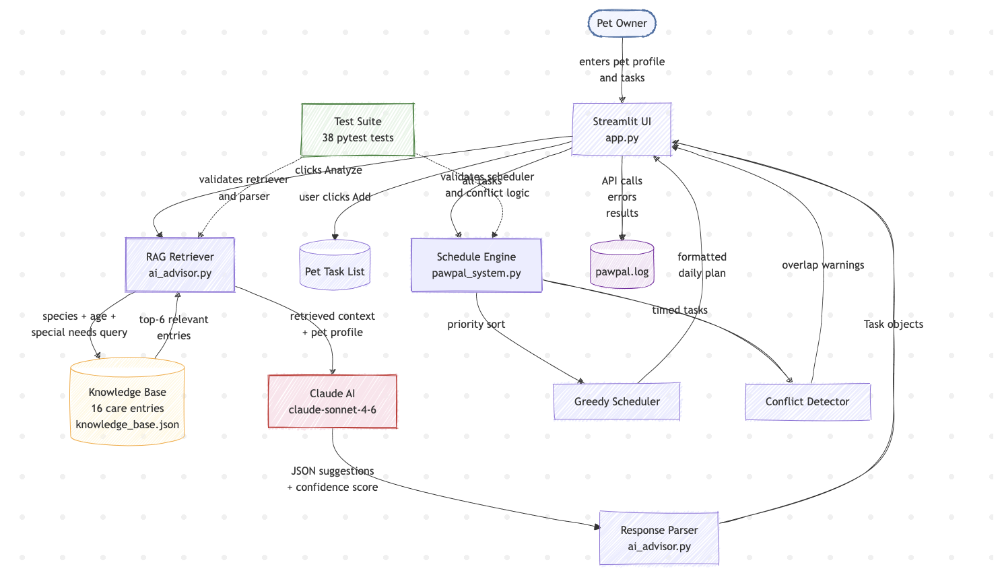
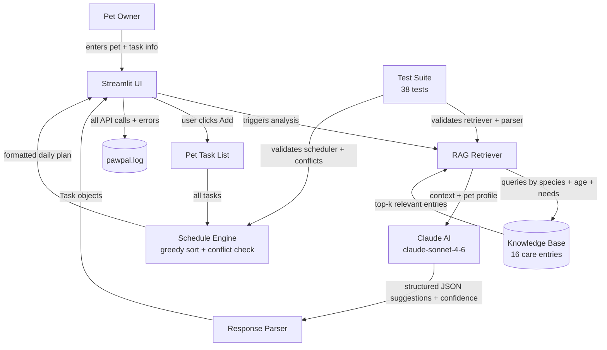

# PawPal+ AI Pet Care Assistant

> A Retrieval-Augmented Generation (RAG) system that helps busy pet owners build complete, prioritized daily care schedules — then uses AI to identify gaps in care before they become health problems.

**GitHub:** [github.com/aliyahmcrae/applied-ai-system-project](https://github.com/aliyahmcrae/applied-ai-system-project)

**Demo Walkthrough (Loom):** [ADD YOUR LOOM LINK HERE]

---

## Original Project (Modules 1–3)

**PawPal+** was originally built as a rule-based scheduling tool for pet owners managing multiple pets. The system used an enum-driven greedy scheduler to prioritize tasks, detected overlapping care windows through an interval-overlap algorithm, and handled daily/weekly task recurrence automatically. It included a Streamlit web UI and a 19-test pytest suite covering scheduling logic, conflict detection, and task filtering. The original system was entirely deterministic — smart, but it could only work with what the user explicitly entered.

---

## What This Version Does & Why It Matters

This capstone version integrates a **RAG-based AI Pet Care Advisor** powered by Claude. The core problem it solves: most pet owners don't know what care they're missing until a vet appointment reveals it. The AI advisor closes that gap proactively.

When a user clicks "Analyze care routine," the system:

1. **Retrieves** the most relevant entries from a 16-entry veterinary care knowledge base, scored by species, age group, and any special needs keywords
2. **Prompts** Claude with the pet's profile + retrieved context, asking it to identify tasks missing from the current schedule
3. **Parses** the structured JSON response into Task objects with duration, priority, and frequency
4. **Surfaces** suggestions in the UI with one-click "Add" buttons that inject the task directly into the schedule

The result is a system where the AI's output is **immediately actionable** — not just advice, but a task that flows into conflict detection, priority sorting, and the generated daily plan.

---

## Architecture Overview





**Main components:**

| Component | File | Role |
|---|---|---|
| Streamlit UI | `app.py` | Owner/pet/task management + AI advisor interface |
| Schedule Engine | `pawpal_system.py` | Priority sort, greedy scheduler, conflict detection, recurrence |
| RAG Retriever | `ai_advisor.py` | Scores knowledge base entries by species, age, special needs |
| Knowledge Base | `knowledge_base.json` | 16 vetted care guidelines (dogs, cats, all species) |
| Claude AI | `ai_advisor.py` | Generates targeted suggestions from retrieved context |
| Logging | `ai_advisor.py` | File + console logs for all API calls, results, and errors |
| Test Suite | `tests/` | 38 pytest cases across scheduling and AI advisor logic |

---

## Setup Instructions

**Requirements:** Python 3.11+

```bash
# 1. Clone the repo
git clone https://github.com/aliyahmcrae/applied-ai-system-project
cd applied-ai-system-project/applied-ai-system-final

# 2. Install dependencies
pip install -r requirements.txt

# 3. Set your Anthropic API key (or enter it in the UI)
export ANTHROPIC_API_KEY="sk-ant-..."

# 4. Run the app
streamlit run app.py

# 5. (Optional) Run the test suite
python -m pytest tests/ -v
```

The app opens at `http://localhost:8501`. If `ANTHROPIC_API_KEY` is set, the AI advisor panel will use it automatically. Otherwise a password field appears in the UI.

---

## Sample Interactions

### 1 — AI Advisor: Dog with only a feeding task

**Setup:** Buddy (dog, 3 years), one existing task: "Morning feeding"

**AI Advisor output:**
```
Found 4 suggestions (confidence: 84%, based on 6 care guidelines)

🔴 Morning walk — 30 min · daily
   Daily exercise maintains healthy weight and prevents behavioral issues from pent-up energy.

🟡 Coat brushing — 10 min · weekly
   Regular brushing reduces shedding and lets you check for ticks or skin irritations early.

🟡 Teeth brushing — 5 min · weekly
   Dental disease affects 80% of dogs over age 3; weekly brushing prevents tartar buildup.

🟢 Training session — 10 min · daily
   Mental enrichment through short training sessions prevents destructive boredom.
```

Each suggestion has an **Add** button. Clicking it adds the task directly to Buddy's list.

---

### 2 — Conflict Detection

**Setup:** Buddy (dog), two tasks with overlapping times:
- Morning walk: 08:00, 30 min, HIGH
- Medication: 08:15, 5 min, HIGH

**Conflict warning displayed in UI:**
```
⚠️ Scheduling Conflicts
These tasks overlap — one pet may be left unattended. Adjust a start time to resolve.

[Buddy] — Morning walk          vs        [Buddy] — Medication
🕐 08:00 · 30 min                         🕐 08:15 · 5 min
💡 Tip: reschedule one of these tasks so they don't overlap.
```

---

### 3 — Multi-pet Schedule Generation

**Setup:** Two pets, 90 minutes available:
- Buddy (dog): Morning walk (30 min, HIGH), Feeding (5 min, HIGH), Training (10 min, MEDIUM)
- Luna (cat): Feeding (5 min, HIGH), Litter scoop (5 min, MEDIUM), Play session (15 min, LOW)

**Generated plan:**
```
╔══════════════════════════════════════════════╗
║           PawPal+ Plan for Jordan            ║
╚══════════════════════════════════════════════╝

  🐶 Buddy
  ────────────────────────────────────────────
  [!!!] Morning walk                  30 min  daily
  [!!!] Feeding                        5 min  daily
  [!! ] Training session              10 min  daily

  🐱 Luna
  ────────────────────────────────────────────
  [!!!] Feeding                        5 min  daily
  [!! ] Litter scoop                   5 min  daily
  [!  ] Play session                  15 min  daily

  ──────────────────────────────────────────────
  Time used  ███████████████████░░░  70/90 min
```

---

## Design Decisions

**Why RAG instead of fine-tuning?**
The knowledge base is small (16 entries) and manually curated. Fine-tuning requires much more data and makes the model harder to update. With RAG, adding a new care guideline is a JSON edit — no retraining.

**Why a JSON knowledge base instead of a vector store?**
For 16 entries, cosine similarity over embeddings is overkill and adds a dependency (a vector DB or embedding API). The scoring heuristic (species match → age group → keyword) is transparent, testable, and fast. If the knowledge base grew to hundreds of entries, a vector store would be the right upgrade.

**Why require species match before scoring age/special-needs?**
Early versions returned dog-specific entries for unknown species (e.g., a fish) because age-group scoring alone could push them into the top-k. The fix — requiring species to match before any other scoring — surfaced in testing and made the retriever's behavior predictable. This is also why `test_unknown_species_returns_universal_entries_only` exists.

**Why structured JSON output from Claude instead of free text?**
Free text would require an NLP parsing step to extract task fields. Asking for one JSON object per line is strict enough to parse reliably but forgiving enough that the model rarely fails — the parser logs and skips any line it can't parse rather than crashing.

**Trade-off — confidence score is self-reported:**
The confidence float comes from Claude's own assessment, not from an external metric. It's a useful signal but not ground truth. A more rigorous system would validate suggestions against the retrieved entries programmatically.

---

## Testing Summary

```
38 tests total — 38 passed (100%)

tests/test_pawpal.py     19 tests  scheduling logic, conflict detection, recurrence
tests/test_ai_advisor.py 19 tests  knowledge base, retriever, parser, full pipeline

All Anthropic API calls are mocked — tests run offline with no API key.
```

**What worked well:**
- Mocking `anthropic.Anthropic` at the class level (`@patch("ai_advisor.anthropic.Anthropic")`) made the full pipeline testable without a real API key
- The species-must-match guard caught a real retriever bug during testing (dog entries appearing for unknown species)
- Confidence scores in manual runs averaged ~0.82; suggestions were noticeably better when the pet had special needs keywords that matched knowledge base entries

**What didn't work initially:**
- The first retriever design scored entries purely on cumulative points, meaning age-group matches could promote wrong-species entries into the top-k. One failing test exposed this and led to the fix described in Design Decisions
- Claude occasionally returned suggestions wrapped in markdown code fences (` ```json ... ``` `) instead of bare JSON lines. The parser silently skipped them. The prompt was tightened to say "no markdown code fences" which resolved the issue in subsequent runs

---

## Reflection

**Limitations and biases:**
The knowledge base was written by hand and reflects general veterinary consensus for common domestic species (dogs and cats dominate). It has no entries for rabbits, fish, reptiles, or birds — owners of those pets get only the universal hydration/feeding entries. The AI's suggestions also depend entirely on what's in the retrieved context; gaps in the knowledge base produce gaps in suggestions.

**Could this be misused?**
The system gives care advice that users might follow without consulting a vet. A suggestion like "administer medication (5 min, daily)" could be dangerous if applied to a pet that doesn't need medication. Mitigations: the system is framed as a scheduling assistant, not a diagnostic tool; the UI notes that suggestions come from general guidelines; and each suggestion asks the user to explicitly click "Add" rather than auto-adding anything.

**What surprised me during reliability testing:**
Claude was much better at avoiding duplicates than expected — even when the existing task list used informal names ("morning walk"), it consistently avoided suggesting tasks that were clearly equivalent. What it struggled with was duration estimation: suggested grooming tasks for a large breed dog often came in at 5 minutes when 20 would be more realistic. This is a known limitation of using general guidelines without breed-specific data.

**What this project taught me:**
Integrating AI into an existing system is less about the model and more about the interface between the model and the rest of the code. The hardest part wasn't the API call — it was designing a prompt that produced output structured enough to parse reliably, and deciding exactly where in the data flow the AI's output should land. Making the suggestions actionable (one click to add, then flowing through the existing schedule engine) took more thought than the RAG retriever itself.

---

## AI Collaboration Notes

**Helpful suggestion:** When building the response parser, the AI suggested asking Claude to output `CONFIDENCE: <float>` on its own line at the end of the response, rather than embedding confidence in a wrapper JSON object. This turned out to be much more robust — a JSON wrapper approach would have required the model to produce a single valid outer object containing an array, which it was more likely to format inconsistently.

**Flawed suggestion:** Early in development, the AI suggested using cosine similarity with sentence-transformers embeddings for the knowledge base retriever. That would have added a large ML dependency and required downloading a model just to search 16 entries. A simple scoring heuristic turned out to be more transparent, faster, and just as accurate for this scale — and far easier to test. The embedding approach would have been appropriate if the knowledge base were orders of magnitude larger.

---

## Portfolio Reflection

> **What this project says about me as an AI engineer:**
>
> PawPal+ reflects how I think about integrating AI into real systems: the hardest part is never the API call — it's the interface between the model and the rest of the code. I spent more time designing the prompt schema, the retrieval scoring heuristic, and the point in the data flow where AI output becomes a first-class `Task` object than I did on the API integration itself. Throughout the project I treated every AI suggestion — both the Claude suggestions during development and the ones generated at runtime — as a first draft to be evaluated against actual requirements, not instructions to follow wholesale. The switch from string priorities to `Priority(Enum)`, the rejection of sentence-transformers for 16 entries, and the decision to make suggestions actionable rather than just informational are all examples of that habit. I'm most proud that the AI's output doesn't exist in a separate advisory box — it flows through the same conflict detection, priority sorting, and plan generation as every other task in the system.
